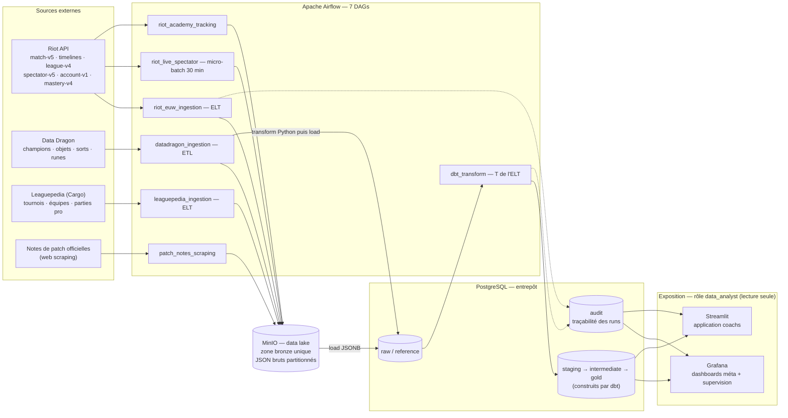

# MyLeague — Plateforme data d'analyse de la méta League of Legends

Projet de fin d'études (RNCP 39586 — Ingénieur en science des données).

**Commanditaire (fictif)** : Nexus Esport Academy, structure e-sport accompagnant joueurs et équipes dans leur progression.

**Problématique** : comment une structure e-sport peut-elle transformer des données de jeu massives, hétérogènes et en évolution constante (un patch toutes les deux semaines) en analyses fiables de la méta, afin d'éclairer ses décisions de draft, d'entraînement et de coaching ?

## Architecture



Architecture en médaillon : **bronze** (JSON bruts dans MinIO, unique zone bronze — écriture locale seulement en mode dégradé sans MinIO), **raw/reference** (warehouse Postgres), **staging → intermediate → gold** (modèles dbt), **audit** (traçabilité des runs). Devise : *MinIO conserve, Postgres calcule.*

## Deux patterns d'intégration assumés

| Source | Pattern | Pourquoi |
|---|---|---|
| Riot API (matchs) | **ELT** | Volumineux, schéma évolutif à chaque patch. JSON brut chargé en JSONB, transformation SQL déléguée à dbt : on peut retraiter tout l'historique sans re-solliciter l'API (rate limits). |
| Data Dragon | **ETL** | Petit référentiel stable. Transformation en Python (typage, aplatissement) avant chargement dans `reference.dim_*`, versionné par patch. |
| Leaguepedia | ELT | Données e-sport pro (tournois, équipes, picks/bans par patch) via l'API Cargo. Permet la comparaison méta pro vs solo queue. |
| CSV internes | ETL | Validation/nettoyage indispensables avant chargement. *(à venir)* |

## Composants

| Service | Rôle | Accès local |
|---|---|---|
| Airflow 3 | Orchestration des pipelines | http://localhost:8080 |
| MinIO | Data lake (bronze) | http://localhost:9001 |
| Postgres `gold` | Warehouse analytique | localhost:5433 |
| dbt | Transformations SQL + tests de qualité | conteneur `myleague-dbt` |
| Grafana | Dashboards méta + supervision | http://localhost:3000 |
| Streamlit | Application web métier (coachs) | http://localhost:8501 |

## Démarrage rapide

```bash
# 1. Configurer les secrets (jamais commités)
cp .env.example .env   # renseigner RIOT_API_KEY

# 2. Lancer la stack
docker compose up -d

# 3. Déclencher les DAGs dans Airflow (localhost:8080)
#    datadragon_ingestion  -> ETL référentiel
#    riot_euw_ingestion    -> ELT matchs Master+ EUW
#    dbt_transform         -> modèles staging/intermediate/gold + tests dbt

# 4. Consulter les dashboards Grafana (localhost:3000)
```

## Développement

```bash
pip install -r requirements-dev.txt
ruff check jobs tests      # lint
pytest                     # tests unitaires
```

La CI GitHub Actions (`.github/workflows/ci.yml`) exécute lint, tests unitaires et validation du projet dbt à chaque push/PR.

## Structure du dépôt

```
airflow/dags/     DAGs Airflow (ingestion ETL/ELT, transformation dbt)
jobs/             Logique métier des pipelines (clients API, ingestion, load)
dbt/              Projet dbt (sources, staging, intermediate, gold, tests)
grafana/          Provisioning datasource + dashboards
postgres/         Schémas et tables d'initialisation du warehouse
data/             Zone bronze locale (non versionnée)
tests/            Tests unitaires (pytest)
```

## Données personnelles et sécurité

Les joueurs sont identifiés par leur `puuid` (identifiant pseudonymisé fourni par Riot) ; aucun nom réel n'est collecté ni stocké. Les secrets (clé API Riot, mots de passe) sont gérés par variables d'environnement via `.env`, exclu du versioning.

Principe du moindre privilège (`postgres/init_roles.sql`) : le rôle `data_engineer` a accès à tous les schémas data ; le rôle `data_analyst` est en lecture seule sur `gold`, `reference` et `audit` — c'est ce rôle qu'utilisent Grafana et l'application Streamlit, qui ne peuvent donc ni écrire ni accéder aux zones brutes. Le détail de la politique de sécurité est documenté dans `docs/` *(à venir, voir ROADMAP)*.

Voir [ROADMAP.md](ROADMAP.md) pour les étapes restantes vers la certification.
