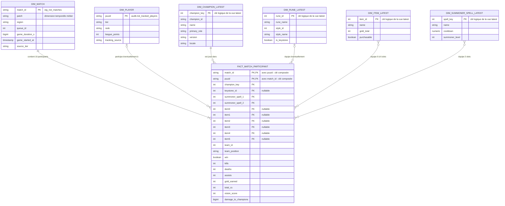
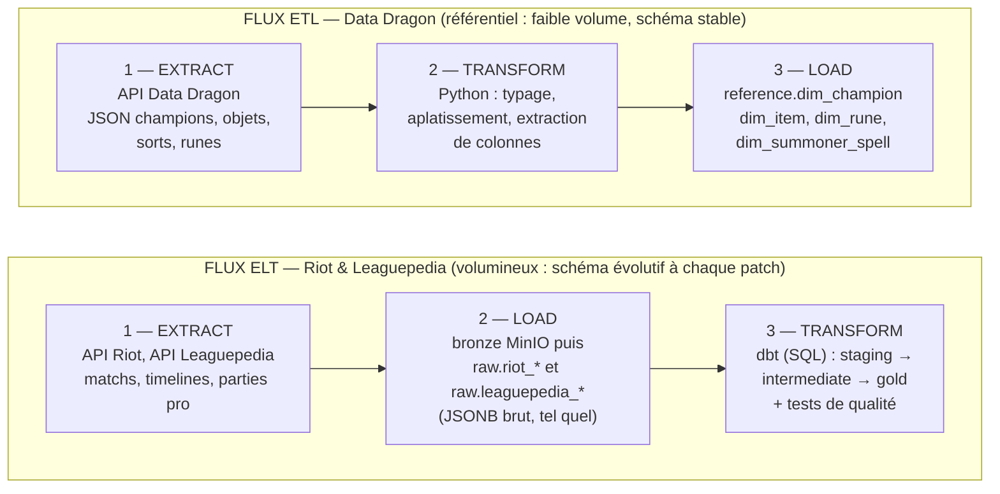
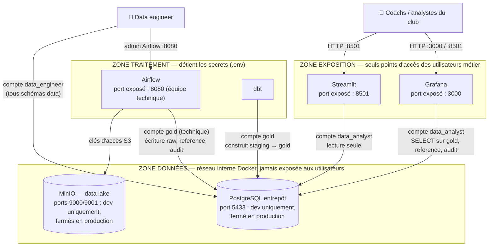

# MyLeague — Plateforme data d'analyse de la méta League of Legends

Projet de fin d'études (RNCP 39586 — Ingénieur en science des données).

**Commanditaire (fictif)** : Nexus Esport Academy, structure e-sport accompagnant joueurs et équipes dans leur progression.

**Problématique** : comment une structure e-sport peut-elle transformer des données de jeu massives, hétérogènes et en évolution constante (un patch toutes les deux semaines) en analyses fiables de la méta, afin d'éclairer ses décisions de draft, d'entraînement et de coaching ?

## Architecture technique en médaillon

```mermaid
flowchart LR
    subgraph SELT["SOURCES EN ELT — volumineuses, schéma évolutif à chaque patch"]
        RIOT["Riot API<br/>matchs · timelines · ladder · live"]
        LPS["Leaguepedia (Cargo)<br/>tournois · équipes · parties pro"]
        PN["Notes de patch officielles<br/>web scraping"]
    end

    subgraph SETL["SOURCES EN ETL — référentiel stable, faible volume"]
        DD["Data Dragon<br/>champions · objets · sorts · runes"]
        CSV["CSV internes du club<br/>(phase 2)"]
    end

    subgraph DOCKER["DOCKER COMPOSE — stack MyLeague"]
        AF["APACHE AIRFLOW<br/>orchestration : 7 pipelines planifiés"]

        subgraph MED["ARCHITECTURE MÉDAILLON"]
            direction TB
            BRONZE[("BRONZE — MinIO<br/>JSON/HTML bruts, immuables<br/>source de vérité")]
            RAW[("RAW — PostgreSQL<br/>zone d'atterrissage SQL<br/>JSONB requêtable")]
            STAGING[("STAGING — PostgreSQL<br/>typage · normalisation<br/>extraction du JSON")]
            INTERMEDIATE[("INTERMEDIATE — PostgreSQL<br/>jointures · enrichissements<br/>règles métier")]
            GOLD[("GOLD — PostgreSQL<br/>indicateurs de méta<br/>tables de consommation")]
            REF[("REFERENCE — PostgreSQL<br/>dimensions typées et<br/>versionnées par patch")]
        end

        AUD[("AUDIT — PostgreSQL<br/>runs · erreurs · volumes<br/>curseurs d'ingestion")]
        GRAF["GRAFANA<br/>dashboards"]
        ST["STREAMLIT<br/>app coachs"]
    end

    SELT ==>|"Extract — API, SQL, scraping"| AF
    SETL ==>|"Extract — API"| AF

    AF ==>|"archivage brut"| BRONZE
    BRONZE ==>|"ELT · Load<br/>JSONB tel quel"| RAW
    RAW ==>|"dbt · typage"| STAGING
    STAGING ==>|"dbt · consolidation"| INTERMEDIATE
    AF ==>|"ETL · Transform Python<br/>puis Load"| REF
    REF -.->|"enrichissement<br/>(noms, versions)"| INTERMEDIATE
    INTERMEDIATE ==>|"dbt + tests qualité"| GOLD

    AF -.->|"journalise"| AUD
    GOLD ==>|"lecture seule"| GRAF
    GOLD ==>|"lecture seule"| ST
    AUD -.->|"supervision"| GRAF

    classDef elt fill:#dbeafe,stroke:#1d4ed8,color:#111827;
    classDef etl fill:#fef3c7,stroke:#b45309,color:#111827;
    classDef bronze fill:#fef3c7,stroke:#b45309,color:#111827;
    classDef silver fill:#f3f4f6,stroke:#4b5563,color:#111827;
    classDef gold fill:#fef9c3,stroke:#a16207,color:#111827;
    classDef transverse fill:#ffe4e6,stroke:#be123c,color:#111827;
    classDef viz fill:#dcfce7,stroke:#15803d,color:#111827;
    classDef orch fill:#ede9fe,stroke:#6d28d9,color:#111827;

    class RIOT,LPS,PN elt;
    class DD,CSV etl;
    class BRONZE bronze;
    class RAW,STAGING,INTERMEDIATE silver;
    class GOLD gold;
    class REF,AUD transverse;
    class GRAF,ST viz;
    class AF orch;
```



### Les 7 pipelines Airflow

| DAG | Rôle | Pattern | Fréquence |
|---|---|---|---|
| `datadragon_ingestion` | Référentiel du jeu (champions, objets, runes) | ETL | Quotidien |
| `riot_euw_ingestion` | Matchs classés + timelines EUW | ELT (E/L) | Quotidien |
| `leaguepedia_ingestion` | Tournois, équipes, parties professionnelles | ELT (E/L) | Quotidien |
| `patch_notes_scraping` | Notes de patch officielles | Scraping | Quotidien (à chaque nouveau patch) |
| `riot_live_spectator` | Parties en cours des joueurs suivis | Micro-batch temps réel | Toutes les 30 min |
| `riot_academy_tracking` | Maîtrises des joueurs du club | ELT | Quotidien |
| `dbt_transform` | Construction des tables d'analyse + tests qualité | ELT (T) | Quotidien |

L'architecture en médaillon est répartie entre le data lake et l'entrepôt : **MinIO est la couche Bronze** et conserve les objets sources rejouables ; `raw` est la zone d'atterrissage SQL ; `staging` et `intermediate` forment ensemble la couche Silver ; `gold` est la couche de consommation. Les schémas `reference` et `audit` sont transverses : le premier fournit les dimensions versionnées, le second assure la traçabilité des traitements. Devise : *MinIO conserve, PostgreSQL calcule.*

### Modèle dimensionnel en étoile

Le grain central est **la participation d'un joueur à un match** : un match valide produit exactement dix lignes dans `intermediate.int_match_participants`. La clé logique de la table de faits est donc `(match_id, puuid)`. Les dimensions Data Dragon suffixées `_LATEST` représentent la vue logique de la version la plus récente utilisée dans les modèles Gold ; les tables physiques `reference.dim_*` conservent, elles, toutes les versions.



| Élément | Table ou modèle physique | Clé | Cardinalité vers la table de faits |
|---|---|---|---|
| Match | `staging.stg_riot_matches` | `match_id` | 1 match → exactement 10 participations valides |
| Joueur suivi | `audit.riot_tracked_players` | `puuid` | 0 ou 1 joueur suivi → 0 à N participations |
| Champion | `reference.dim_champion` | physique : `(version, locale, champion_id)` ; logique latest : `champion_key` | 1 champion → 0 à N participations |
| Rune | `reference.dim_rune` | physique : `(version, locale, rune_id)` ; logique latest : `rune_id` | 0 ou 1 keystone par participation |
| Objet | `reference.dim_item` | physique : `(version, locale, item_id)` ; logique latest : `item_id` | 0 à 6 objets par participation |
| Sort d'invocateur | `reference.dim_summoner_spell` | physique : `(version, locale, spell_id)` ; logique latest : `spell_key` | 2 sorts par participation |
| Fait central | `intermediate.int_match_participants` | logique : `(match_id, puuid)` | 1 ligne par joueur et par match |

Les mentions `PK` et `FK` du diagramme expriment le **contrat dimensionnel logique**. PostgreSQL impose déjà certaines clés dans `raw`, `reference` et `audit`, tandis que les modèles dbt contrôlent l'intégrité analytique avec des tests d'unicité, de non-nullité et de relations. Les tables `gold_*` sont des agrégats dérivés de cette étoile selon différents grains (`patch + champion`, `patch + tier + champion`, `patch + champion + item`, etc.).

## Deux patterns d'intégration assumés

| Source | Pattern | Pourquoi |
|---|---|---|
| Riot API (matchs) | **ELT** | Volumineux, schéma évolutif à chaque patch. JSON brut chargé en JSONB, transformation SQL déléguée à dbt : on peut retraiter tout l'historique sans re-solliciter l'API (rate limits). |
| Data Dragon | **ETL** | Petit référentiel stable. Transformation en Python (typage, aplatissement) avant chargement dans `reference.dim_*`, versionné par patch. |
| Leaguepedia | ELT | Données e-sport pro (tournois, équipes, picks/bans par patch) via l'API Cargo. Permet la comparaison méta pro vs solo queue. |
| CSV internes | ETL | Validation/nettoyage indispensables avant chargement. *(à venir)* |



La différence tient à la place du T : en **ETL**, la donnée est transformée *avant* d'entrer dans l'entrepôt (adapté à un référentiel stable et léger) ; en **ELT**, la donnée brute entre d'abord, et la transformation SQL se rejoue à volonté sur tout l'historique sans rappeler l'API (décisif sous contrainte de quotas).

## Composants

| Service | Rôle | Accès local |
|---|---|---|
| Airflow 3 | Orchestration des pipelines | http://localhost:8080 |
| MinIO | Data lake (bronze) | http://localhost:9001 |
| Postgres `gold` | Warehouse analytique | localhost:5433 |
| dbt | Transformations SQL + tests de qualité | conteneur `myleague-dbt` |
| Grafana | Dashboards méta + supervision | http://localhost:3000 |
| Streamlit | Application web métier (coachs) | http://localhost:8501 |

## Démarrage rapide

```bash
# 1. Configurer les secrets (jamais commités)
cp .env.example .env   # renseigner RIOT_API_KEY

# 2. Lancer la stack
docker compose up -d

# 3. Déclencher les DAGs dans Airflow (localhost:8080)
#    datadragon_ingestion  -> ETL référentiel
#    riot_euw_ingestion    -> ELT matchs Master+ EUW
#    dbt_transform         -> modèles staging/intermediate/gold + tests dbt

# 4. Consulter les dashboards Grafana (localhost:3000)
```

## Développement

```bash
pip install -r requirements-dev.txt
ruff check jobs tests      # lint
pytest                     # tests unitaires
```

La CI GitHub Actions (`.github/workflows/ci.yml`) exécute lint, tests unitaires et validation du projet dbt à chaque push/PR.

## Structure du dépôt

```
airflow/dags/     DAGs Airflow (ingestion ETL/ELT, transformation dbt)
jobs/             Logique métier des pipelines (clients API, ingestion, load)
dbt/              Projet dbt (sources, staging, intermediate, gold, tests)
grafana/          Provisioning datasource + dashboards
postgres/         Schémas et tables d'initialisation du warehouse
data/             Zone bronze locale (non versionnée)
tests/            Tests unitaires (pytest)
```

## Données personnelles et sécurité

Les joueurs sont identifiés par leur `puuid` (identifiant pseudonymisé fourni par Riot) ; aucun nom réel n'est collecté ni stocké. Les secrets (clé API Riot, mots de passe) sont gérés par variables d'environnement via `.env`, exclu du versioning.

Principe du moindre privilège (`postgres/init_roles.sql`) : le rôle `data_engineer` a accès à tous les schémas data ; le rôle `data_analyst` est en lecture seule sur `gold`, `reference` et `audit` — c'est ce rôle qu'utilisent Grafana et l'application Streamlit, qui ne peuvent donc ni écrire ni accéder aux zones brutes.

### Architecture de sécurité — trois zones



En développement local, les ports de la zone données (5433, 9000/9001) sont publiés pour faciliter le travail (DBeaver, console MinIO) ; la cible de production les ferme et ajoute TLS sur les interfaces exposées via un reverse proxy. Le détail de la politique de sécurité est documenté dans `docs/` *(à venir, voir ROADMAP)*.

Voir [ROADMAP.md](ROADMAP.md) pour les étapes restantes vers la certification.
