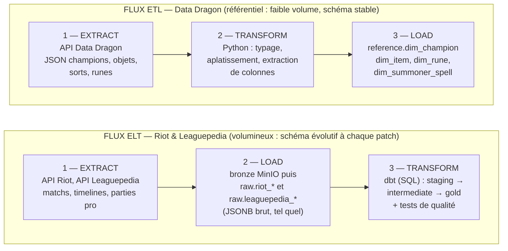
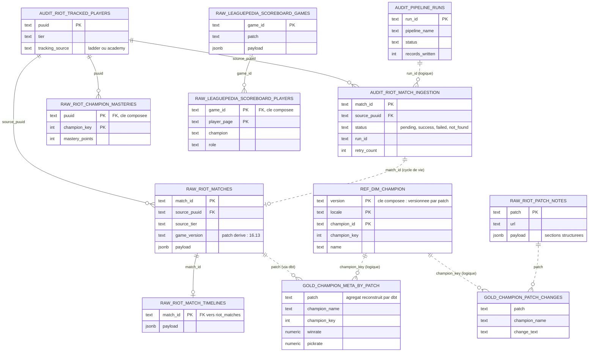
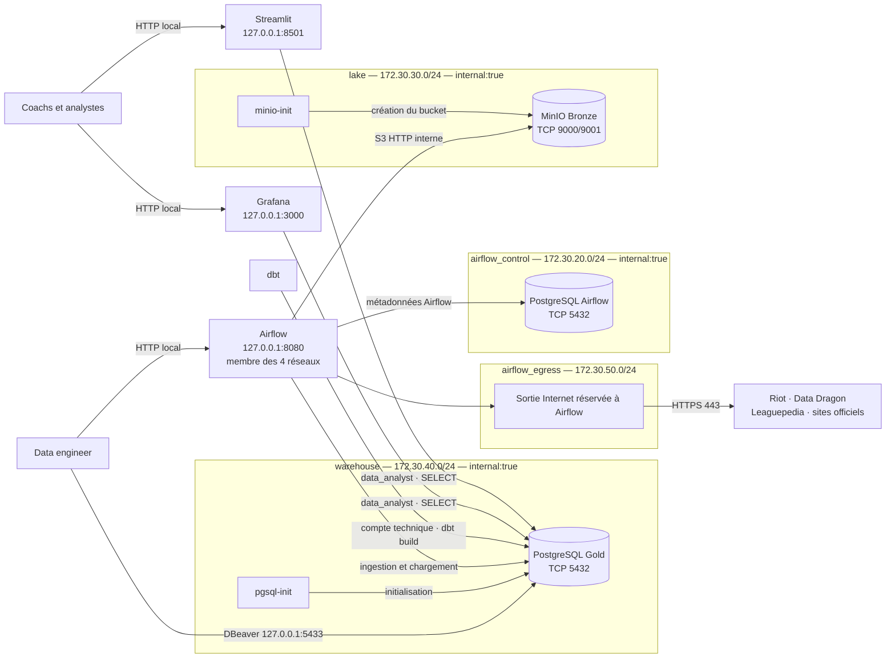

# MyLeague — Plateforme data d'analyse de la méta League of Legends
a
Projet de fin d'études (RNCP 39586 — Ingénieur en science des données).

**Commanditaire (fictif)** : Nexus Esport Academy, structure e-sport accompagnant joueurs et équipes dans leur progression.

**Problématique** : comment une structure e-sport peut-elle transformer des données de jeu massives, hétérogènes et en évolution constante (un patch toutes les deux semaines) en analyses fiables de la méta, afin d'éclairer ses décisions de draft, d'entraînement et de coaching ?

## Pseudos dans l'application

Les sélecteurs de joueurs utilisent le dernier Riot ID connu (`Pseudo#TAG`) dans
les matchs collectés, via `gold.gold_player_names`, ou le pseudo enregistré dans
le suivi Academy. Sans identité connue, ils affichent « Pseudo indisponible »,
jamais un morceau de PUUID. Le PUUID reste la clé interne de sélection et de jointure.
Les pseudos issus des matchs sont historiques : un renommage sera visible après
collecte d'un nouveau match et build dbt, sans appels Riot supplémentaires.

Après pull, créer ce modèle **avant** de reconstruire le service web :

```bash
docker compose exec -T airflow dbt build --select +gold_player_names --project-dir /opt/airflow/dbt --profiles-dir /opt/airflow/dbt/profiles
docker compose up -d --build web
```

Les prochains `dbt_transform` rafraîchiront automatiquement les pseudos. La liste
« En direct » utilise déjà les Riot IDs saisis par le coach et reste inchangée.

## CI/CD GitHub Actions

La CI s'exécute sur `dev`, `main` et les pull requests : tests unitaires, frontend,
builds Docker et intégrations sur PostgreSQL/MinIO/dbt/Spark jetables. Le déploiement
VPS est déclenché manuellement après les tests et nécessite les secrets SSH de
l'environnement GitHub `production`. Voir le [guide CI/CD](CI_CD.md).

## Calcul distribué Spark (optionnel)

Le profil Docker Compose `spark` ajoute un master, deux workers et un lanceur
interne piloté par le DAG manuel `spark_matchups`. Il calcule les match-ups par
champion, rôle et patch à partir des participants Gold issus de dbt, puis publie
`gold.spark_champion_matchups`. Il complète la collecte quasi-temps réel sans la modifier.

Voir le [guide Spark](services/spark/README.md) pour le déploiement, le test
synthétique, les requêtes de consultation et la preuve d'exécution sur deux workers.
Sur un VPS unique, il s'agit de plusieurs processus distribués sur une seule machine,
pas d'une infrastructure multi-serveurs. Le frontend n'est pas modifié par cet ajout.

## Architecture technique en médaillon

```mermaid
flowchart LR
    subgraph SELT["SOURCES EN ELT — volumineuses, schéma évolutif à chaque patch"]
        RIOT["Riot API<br/>matchs · timelines · ladder · live"]
        LPS["Leaguepedia (Cargo)<br/>tournois · équipes · parties pro"]
        PN["Notes de patch officielles<br/>web scraping"]
    end

    subgraph SETL["SOURCES EN ETL — référentiel stable, faible volume"]
        DD["Data Dragon<br/>champions · objets · sorts · runes"]
        CSV["CSV internes du club<br/>(phase 2)"]
    end

    subgraph DOCKER["DOCKER COMPOSE — stack MyLeague"]
        AF["APACHE AIRFLOW<br/>orchestration : 7 pipelines planifiés"]

        subgraph MED["ARCHITECTURE MÉDAILLON"]
            direction TB
            BRONZE[("BRONZE — MinIO<br/>JSON/HTML bruts, immuables<br/>source de vérité")]
            RAW[("RAW — PostgreSQL<br/>zone d'atterrissage SQL<br/>JSONB requêtable")]
            STAGING[("STAGING — PostgreSQL<br/>typage · normalisation<br/>extraction du JSON")]
            INTERMEDIATE[("INTERMEDIATE — PostgreSQL<br/>jointures · enrichissements<br/>règles métier")]
            GOLD[("GOLD — PostgreSQL<br/>indicateurs de méta<br/>tables de consommation")]
            REF[("REFERENCE — PostgreSQL<br/>dimensions typées et<br/>versionnées par patch")]
        end

        AUD[("AUDIT — PostgreSQL<br/>runs · erreurs · volumes<br/>curseurs d'ingestion")]
        GRAF["GRAFANA<br/>dashboards"]
        ST["STREAMLIT<br/>app coachs"]
    end

    SELT ==>|"Extract — API, SQL, scraping"| AF
    SETL ==>|"Extract — API"| AF

    AF ==>|"archivage brut"| BRONZE
    BRONZE ==>|"ELT · Load<br/>JSONB tel quel"| RAW
    RAW ==>|"dbt · typage"| STAGING
    STAGING ==>|"dbt · consolidation"| INTERMEDIATE
    AF ==>|"ETL · Transform Python<br/>puis Load"| REF
    REF -.->|"enrichissement<br/>(noms, versions)"| INTERMEDIATE
    INTERMEDIATE ==>|"dbt + tests qualité"| GOLD

    AF -.->|"journalise"| AUD
    GOLD ==>|"lecture seule"| GRAF
    GOLD ==>|"lecture seule"| ST
    AUD -.->|"supervision"| GRAF

    classDef elt fill:#dbeafe,stroke:#1d4ed8,color:#111827;
    classDef etl fill:#fef3c7,stroke:#b45309,color:#111827;
    classDef bronze fill:#fef3c7,stroke:#b45309,color:#111827;
    classDef silver fill:#f3f4f6,stroke:#4b5563,color:#111827;
    classDef gold fill:#fef9c3,stroke:#a16207,color:#111827;
    classDef transverse fill:#ffe4e6,stroke:#be123c,color:#111827;
    classDef viz fill:#dcfce7,stroke:#15803d,color:#111827;
    classDef orch fill:#ede9fe,stroke:#6d28d9,color:#111827;

    class RIOT,LPS,PN elt;
    class DD,CSV etl;
    class BRONZE bronze;
    class RAW,STAGING,INTERMEDIATE silver;
    class GOLD gold;
    class REF,AUD transverse;
    class GRAF,ST viz;
    class AF orch;
```



### Application coach / joueur — React et FastAPI

La nouvelle application est séparée en `frontend/` (React/TypeScript) et
`backend/` (FastAPI). Ses trois espaces sont **Draft**, **Entraînement** et
**Coaching** : priorités pick/ban, flex picks, match-ups, compositions observées,
plan Academy, historique individuel et matchs communs de cinq joueurs sélectionnés.

[Démarrage local, déploiement VPS et limites des analyses](backend/README.md).
Le service Docker `web` utilise le port privé `8501`. Streamlit est conservé en
secours sous le profil `legacy`, sur `8502`. L'accès reste privé via SSH, sans
comptes web. Les sections historiques relatives à Streamlit décrivent cette
interface de secours ; la nouvelle API utilise le même rôle `data_analyst`.

Les analyses de situations de jeu issues des timelines ne sont pas encore
implémentées. Les matchs collectés sont en solo queue : le collectif ne sera
alimenté que si les cinq joueurs apparaissent effectivement ensemble du même côté.

### Leaguepedia : historique annuel des parties de compétition

Le DAG `leaguepedia_ingestion` commence par `ingest_year_history`, puis conserve
la collecte récente et les catalogues existants. `LEAGUEPEDIA_YEAR=0` cible
l'année UTC courante (2026 actuellement), du 1er janvier jusqu'au début du run.
Une année explicite permet de cibler un historique antérieur.

- Jusqu'à 45 journées par run, budget souple de 15 minutes entre journées,
  timeout dur de 25 minutes pour la tâche annuelle. Une journée interrompue est rejouée.
- Les deux derniers jours sont rafraîchis, puis les journées manquantes les plus
  anciennes. Une fois l'historique couvert, les anciennes journées sont revisitées
  par ancienneté de vérification pour récupérer d'éventuelles corrections tardives.
- Matchs et statistiques joueurs utilisent des fenêtres `[début, fin[` en UTC.
  Une fenêtre saturée est subdivisée ; aucun dépassement n'est accepté silencieusement.
- `audit.leaguepedia_year_days` conserve les journées chargées et leurs volumes.
  Une journée n'est validée qu'après chargement de toutes les lignes renvoyées.
  Un run réussi peut être un lot intermédiaire : consulter `days_remaining` dans
  son résultat avant d'annoncer une couverture annuelle.
- Les participants sont collectés sans filtre de retraite ou de ligue ; le
  catalogue `Players` conserve son filtre de joueurs actifs. La couverture concerne
  les parties datées présentes dans Leaguepedia, pas les parties solo queue des pros,
  les scrims privés ni une garantie d'exhaustivité du monde professionnel.

Le DAG complet dispose désormais de 75 minutes et peut donc chevaucher le dbt
suivant pendant le rattrapage. Une fois le lot terminé, relancer `dbt_transform`
si nécessaire. Les compteurs annuels sont des observations de source, pas une
preuve que Leaguepedia a documenté chaque compétition.

Déploiement : push/pull, puis `docker compose restart airflow`. Aucun nouveau
secret requis. Activer/déclencher `leaguepedia_ingestion` dans Airflow et inspecter
`ingest_year_history`. Les tables raw et la sauvegarde bronze restent inchangées.

### Les 7 pipelines planifiés et le backfill manuel

| DAG | Rôle | Pattern | Fréquence |
|---|---|---|---|
| `datadragon_ingestion` | Référentiel du jeu (champions, objets, runes) | ETL | Chaque jour à 00:00 UTC |
| `riot_euw_ingestion` | Matchs classés + timelines EUW | ELT (E/L) | Toutes les 3 h : 00:00, 03:00, …, 21:00 UTC |
| `leaguepedia_ingestion` | Tournois, équipes, parties professionnelles | ELT (E/L) | Toutes les 6 h : 01:00, 07:00, 13:00, 19:00 UTC |
| `patch_notes_scraping` | Notes de patch officielles | Scraping | Chaque jour à 02:00 UTC (si nouveau patch) |
| `riot_live_spectator` | Ancien DAG conservé pour son historique | Remplacé par `riot-live` | Désactivé, y compris les tâches manuelles |
| `riot_academy_tracking` | Maîtrises des joueurs du club | ELT | Deux fois par jour : 04:45 et 16:45 UTC |
| `dbt_transform` | Construction des tables d'analyse + tests qualité | ELT (T) | Toutes les 3 h : 02:00, 05:00, …, 23:00 UTC |
| `pipeline_health_monitoring` | Détection des échecs et retards, notification optionnelle | Monitoring | Toutes les 15 min |
| `riot_historical_backfill` | Rattrapage historique Riot sur 60 jours | ELT | Manuel uniquement |

Les dates de départ des DAGs utilisent explicitement UTC, conformément au
[fonctionnement des fuseaux Airflow](https://airflow.apache.org/docs/apache-airflow/stable/authoring-and-scheduling/timezone.html).
En France métropolitaine, ajouter 1 heure en hiver et 2 heures en été : le build Gold
de 02:00 UTC commence donc à 03:00 ou 04:00 heure de Paris.

Ce planning intensif vise une collecte sur trois jours, mais ne s'arrête pas
automatiquement après 72 heures. Revenir ensuite à une cadence quotidienne si nécessaire.
Riot démarre huit fois par jour avec un timeout de 90 minutes ; dbt démarre deux
heures après chaque départ Riot. Leaguepedia peut chevaucher la fin de Riot,
mais dispose de 60 minutes avant dbt pour un timeout de 45 minutes.
Academy démarre après le créneau maximal de Riot ; sa fin peut chevaucher dbt.
Data Dragon et les patch notes restent quotidiens : augmenter leur fréquence
n'augmente pas le nombre de matchs historiques disponibles.

Avec les paramètres actuels (25 joueurs, 10 matchs par joueur, plafond de 250
tentatives par run), 24 runs Riot sur 72 heures représentent au maximum 6 000
tentatives de collecte, pas 6 000 nouveaux matchs garantis. Les quotas, erreurs,
doublons et matchs disponibles réduisent le résultat. Le sélecteur privilégie les
joueurs jamais collectés, puis ceux dont la dernière collecte est la plus ancienne.
La fenêtre de sept jours n'est pas un historique exhaustif : la requête par joueur
est limitée à dix matchs et n'est pas paginée. Ce planning privilégie donc
l'élargissement de l'échantillon plutôt qu'un historique complet par joueur.
Les timelines restent activées pour conserver les données utiles au coaching.
Surveiller les erreurs 429/401/403, la validité de la clé Riot, les timeouts et
l'espace disque ; si les runs échouent, corriger avant d'augmenter les plafonds.
Le service Docker `riot-live` collecte désormais en continu : 5 joueurs toutes les
60 secondes par défaut, sous réserve des délais et quotas Riot partagés avec les ingestions.
La vue **Coaching → En direct** se rafraîchit toutes les 15 secondes, sans attendre dbt.
Il s'agit de quasi-temps réel par polling, pas de télémétrie seconde par seconde.
Voir le [guide de déploiement et de démonstration](services/riot-live/README.md).
Le monitoring reste actif à :00, :15, :30 et :45. Le backfill consomme beaucoup
d'appels API : le déclencher hors des créneaux Riot/Academy et éviter les relances simultanées.

Tous les DAGs conservent `catchup=False` et limitent les runs actifs à un par DAG.
Cela évite de rattraper automatiquement des mois d'historique après une interruption.
Activer les sept DAGs planifiés dans l'interface Airflow après le déploiement ;
une modification du code ne dépausera pas les DAGs déjà présents.

Ce planning fixe ne constitue pas une dépendance entre DAGs : dbt démarre à l'heure prévue
même si une ingestion échoue ou reste en retard. Contrôler les runs sources avant
d'interpréter la fraîcheur du Gold ; après une reprise manuelle d'ingestion, relancer
`dbt_transform`. Les tables d'audit ne couvrent pas encore tous les pipelines :
vérifier également leurs états directement dans Airflow.

L'architecture en médaillon est répartie entre le data lake et l'entrepôt : **MinIO est la couche Bronze** et conserve les objets sources rejouables ; `raw` est la zone d'atterrissage SQL ; `staging` et `intermediate` forment ensemble la couche Silver ; `gold` est la couche de consommation. Les schémas `reference` et `audit` sont transverses : le premier fournit les dimensions versionnées, le second assure la traçabilité des traitements. Devise : *MinIO conserve, PostgreSQL calcule.*

### Modèle dimensionnel en étoile

Le grain central est **la participation d'un joueur à un match** : un match valide produit exactement dix lignes dans `intermediate.int_match_participants`. La clé logique de la table de faits est donc `(match_id, puuid)`. Les dimensions Data Dragon suffixées `_LATEST` représentent la vue logique de la version la plus récente utilisée dans les modèles Gold ; les tables physiques `reference.dim_*` conservent, elles, toutes les versions.


| Élément | Table ou modèle physique | Clé | Cardinalité vers la table de faits |
|---|---|---|---|
| Match | `staging.stg_riot_matches` | `match_id` | 1 match → exactement 10 participations valides |
| Joueur suivi | `audit.riot_tracked_players` | `puuid` | 0 ou 1 joueur suivi → 0 à N participations |
| Champion | `reference.dim_champion` | physique : `(version, locale, champion_id)` ; logique latest : `champion_key` | 1 champion → 0 à N participations |
| Rune | `reference.dim_rune` | physique : `(version, locale, rune_id)` ; logique latest : `rune_id` | 0 ou 1 keystone par participation |
| Objet | `reference.dim_item` | physique : `(version, locale, item_id)` ; logique latest : `item_id` | 0 à 6 objets par participation |
| Sort d'invocateur | `reference.dim_summoner_spell` | physique : `(version, locale, spell_id)` ; logique latest : `spell_key` | 2 sorts par participation |
| Fait central | `intermediate.int_match_participants` | logique : `(match_id, puuid)` | 1 ligne par joueur et par match |

Les mentions `PK` et `FK` du diagramme expriment le **contrat dimensionnel logique**. PostgreSQL impose déjà certaines clés dans `raw`, `reference` et `audit`, tandis que les modèles dbt contrôlent l'intégrité analytique avec des tests d'unicité, de non-nullité et de relations. Les tables `gold_*` sont des agrégats dérivés de cette étoile selon différents grains (`patch + champion`, `patch + tier + champion`, `patch + champion + item`, etc.).

## Deux patterns d'intégration assumés

| Source | Pattern | Pourquoi |
|---|---|---|
| Riot API (matchs) | **ELT** | Volumineux, schéma évolutif à chaque patch. JSON brut chargé en JSONB, transformation SQL déléguée à dbt : on peut retraiter tout l'historique sans re-solliciter l'API (rate limits). |
| Data Dragon | **ETL** | Petit référentiel stable. Transformation en Python (typage, aplatissement) avant chargement dans `reference.dim_*`, versionné par patch. |
| Leaguepedia | ELT | Données e-sport pro (tournois, équipes, picks/bans par patch) via l'API Cargo. Permet la comparaison méta pro vs solo queue. |
| CSV internes | ETL | Validation/nettoyage indispensables avant chargement. *(à venir)* |



La différence tient à la place du T : en **ETL**, la donnée est transformée *avant* d'entrer dans l'entrepôt (adapté à un référentiel stable et léger) ; en **ELT**, la donnée brute entre d'abord, et la transformation SQL se rejoue à volonté sur tout l'historique sans rappeler l'API (décisif sous contrainte de quotas).

## Modèle de données

Traits pleins = clés étrangères déclarées en base · traits pointillés = liens logiques (vérifiés par les tests dbt `relationships`). Les clés qui structurent le modèle : `match_id`, `puuid`, `champion_key`, `patch`.



Le référentiel (`dim_champion`, et de même `dim_item`, `dim_rune`, `dim_summoner_spell`) est versionné par patch et par langue — clé composée (version, locale, id). Les tables gold, reconstruites par dbt à chaque exécution, ne portent pas de clés étrangères : leurs liens sont vérifiés par les tests dbt à chaque build.

## Composants

| Service | Rôle | Accès local |
|---|---|---|
| Airflow 3 | Orchestration des pipelines | http://localhost:8080 |
| MinIO | Data lake (bronze) | http://localhost:9001 |
| Postgres `gold` | Warehouse analytique | localhost:5433 |
| dbt | Transformations SQL + tests de qualité | conteneur `myleague-dbt` |
| Grafana | Dashboards méta + supervision | http://localhost:3000 |
| MyLeague Web | Application React / FastAPI coach et joueur | http://localhost:8501 |
| Streamlit (profil `legacy`) | Interface historique de secours | http://localhost:8502 |

### Fonctionnalités métier Streamlit

- **Tier list** : pickrate, banrate, présence et winrate avec seuil d'échantillon ;
- **Préparation de draft** : recommandations explicables, filtres par rôle et confiance ;
- **Évolution des patchs** : comparaison au patch précédent et rapprochement avec les notes officielles ;
- **Plan d'entraînement** : écart entre le pool des joueurs academy et les priorités de la méta ;
- **Builds et runes** : choix les plus fréquents et leurs performances ;
- **Supervision** : derniers runs, volumes, erreurs et alertes actives.

## Démarrage rapide

```bash
# 1. Configurer les secrets (jamais commités)
cp .env.example .env   # renseigner RIOT_API_KEY

# 2. Lancer la stack
docker compose up -d

# 3. Déclencher les DAGs dans Airflow (localhost:8080)
#    datadragon_ingestion  -> ETL référentiel
#    riot_euw_ingestion    -> ELT matchs Master+ EUW
#    dbt_transform         -> modèles staging/intermediate/gold + tests dbt

# 4. Consulter les dashboards Grafana (localhost:3000)
```

## Développement

```bash
pip install -r requirements-dev.txt
ruff check jobs tests airflow/dags app  # lint
pytest                     # tests unitaires
dbt parse --no-partial-parse --project-dir dbt --profiles-dir dbt/profiles
```

La CI GitHub Actions (`.github/workflows/ci.yml`) exécute lint, tests unitaires et validation du projet dbt à chaque push/PR.

## Structure du dépôt

```
airflow/dags/     DAGs Airflow (ingestion ETL/ELT, transformation dbt)
jobs/             Logique métier des pipelines (clients API, ingestion, load)
dbt/              Projet dbt (sources, staging, intermediate, gold, tests)
grafana/          Provisioning datasource + dashboards
postgres/         Schémas et tables d'initialisation du warehouse
data/             Zone bronze locale (non versionnée)
tests/            Tests unitaires (pytest)
```

## Données personnelles et sécurité

Les joueurs sont identifiés par leur `puuid` (identifiant pseudonymisé fourni par Riot) ; aucun nom réel n'est collecté ni stocké. Les secrets (clé API Riot, mots de passe) sont gérés par variables d'environnement via `.env`, exclu du versioning.

Principe du moindre privilège (`postgres/init_roles.sql`) : le rôle `data_engineer` a accès à tous les schémas data ; le rôle `data_analyst` est en lecture seule sur `gold`, `reference` et `audit` — c'est ce rôle qu'utilisent Grafana et Streamlit, qui ne peuvent donc ni écrire ni accéder aux zones brutes.

### État des contrôles de sécurité

La documentation distingue les contrôles réellement présents dans le dépôt de la cible de production. Une mesure marquée **prévue** ne doit pas être présentée comme implémentée lors de la soutenance.

| Contrôle | État | Preuve ou limite actuelle |
|---|---|---|
| Pseudonymisation des joueurs par `puuid` | Actif | Aucun état civil nécessaire aux analyses |
| Séparation des rôles PostgreSQL | Actif | `data_engineer` et `data_analyst` dans `postgres/init_roles.sql` |
| Lecture seule de Streamlit et Grafana | Actif | Connexion avec `data_analyst`, sans droit sur `raw`, `staging` ou `intermediate` |
| Segmentation des réseaux Docker | Actif en développement | Six réseaux déclarés dans `docker-compose.yml`, dont trois `internal: true` ; `local_data_admin` reste un pont d'administration partagé |
| Limitation des ports au poste local | Actif en développement | Tous les ports publiés écoutent uniquement sur `127.0.0.1` |
| HTTPS vers Riot, Data Dragon et Leaguepedia | Actif | Clients sortants configurés avec des URL HTTPS |
| TLS des interfaces utilisateur | Prévu | Aucun reverse proxy ni certificat présent dans le dépôt |
| TLS PostgreSQL et MinIO internes | Prévu | Connexions actuelles en clair sur les réseaux Docker internes |
| Chiffrement applicatif des volumes | Prévu | Volumes Docker persistants, sans configuration de chiffrement dans Compose |
| Sauvegardes chiffrées et restauration | Prévu | Aucun job de sauvegarde ou rapport de restauration présent |
| Gestion centralisée et rotation des secrets | Partiel | `.env` non versionné, mais secrets injectés en variables d'environnement et valeurs locales faibles par défaut |
| Tests de refus d'accès | Défini, à exécuter | Cas de test documentés ci-dessous ; campagne de recette à conserver |
| Tests TLS et chiffrement | Prévu | Exécutables uniquement après déploiement des contrôles cibles |

### Architecture réseau active en développement



Les réseaux Docker assurent une isolation par appartenance : un conteneur ne résout et ne joint que les services présents sur un réseau commun. Le réseau `warehouse` reste partagé par les consommateurs autorisés ; le filtrage fin à l'intérieur de ce réseau est assuré par les rôles PostgreSQL, pas par un pare-feu par conteneur.

| Réseau | Sous-réseau | Services autorisés | Règle active |
|---|---|---|---|
| `local_ui` | `172.30.10.0/24` | `streamlit`, `pgsql-init`, `grafana` | Réseau local de l'interface et du bootstrap ; aucun accès entrant externe |
| `local_data_admin` | `172.30.15.0/24` | `postgres`, `minio`, `gold-postgres` | Pont local d'administration ; ce réseau partagé n'est pas une frontière d'isolation |
| `airflow_control` | `172.30.20.0/24` | `postgres`, `airflow` | Seul Airflow accède à sa base de métadonnées |
| `lake` | `172.30.30.0/24` | `minio`, `minio-init`, `airflow` | Streamlit, Grafana et dbt ne peuvent pas joindre MinIO |
| `warehouse` | `172.30.40.0/24` | `gold-postgres`, `pgsql-init`, `airflow`, `dbt`, `streamlit`, `grafana` | Accès réseau au warehouse, puis filtrage SQL par rôle |
| `airflow_egress` | `172.30.50.0/24` | `airflow` | Seul Airflow dispose du réseau de sortie destiné aux collectes |
| `edge` | `172.30.10.0/24` | Reverse proxy uniquement | Prévu en production ; non déclaré dans Compose aujourd'hui |

Tous les ports publiés sont liés à `127.0.0.1`. Cette mesure empêche une exposition directe sur le réseau local, mais elle ne remplace ni l'authentification ni TLS. En développement, `local_data_admin` relie encore les trois services de données qui y sont attachés ; la cible de production est de supprimer ce pont et d'administrer ces services via un bastion ou des ports locaux contrôlés.

### Règles de filtrage

| Priorité | Source | Destination | Décision | État |
|---:|---|---|---|---|
| 1 | Internet | PostgreSQL, MinIO | Refuser tout accès direct | Actif sur le réseau local grâce au binding `127.0.0.1`; fermeture totale prévue en production |
| 2 | Coach | Streamlit, Grafana | Autoriser uniquement les interfaces métier | Accès privé via SSH ; reverse proxy authentifié prévu |
| 3 | Data engineer | Airflow et outils d'administration | Autoriser depuis le poste local ; VPN/bastion prévu en production | Partiel |
| 4 | Streamlit, Grafana | PostgreSQL Gold | Autoriser TCP 5432 avec `data_analyst` | Actif |
| 5 | Streamlit, Grafana, dbt | MinIO | Refuser par absence d'appartenance au réseau `lake` | Actif |
| 6 | Airflow | MinIO, PostgreSQL Gold, PostgreSQL Airflow | Autoriser uniquement les flux nécessaires aux pipelines | Actif par segmentation réseau |
| 7 | Airflow | Sources externes | Autoriser HTTPS 443 sortant | Actif |
| 8 | Tout autre flux interzone | Toute destination | Refus implicite par absence de réseau commun | Actif, dans les limites du modèle réseau Docker |

### Matrice détaillée des flux

| Source | Destination | Port | Protocole actuel | Identité ou contrôle | État cible |
|---|---|---:|---|---|---|
| Coach | Streamlit | 8501 | HTTP/TCP sur `127.0.0.1` | Tunnel SSH | HTTPS 443 via reverse proxy et authentification |
| Coach | Grafana | 3000 | HTTP/TCP sur `127.0.0.1` | Compte Grafana | HTTPS 443 via reverse proxy |
| Data engineer | Airflow | 8080 | HTTP/TCP sur `127.0.0.1` | Compte administrateur Airflow | HTTPS 443 depuis VPN/bastion |
| Data engineer | PostgreSQL Gold | 5433 vers 5432 | PostgreSQL/TCP sur `127.0.0.1` | `data_engineer` | `sslmode=verify-full` depuis VPN/bastion |
| Data engineer | Console MinIO | 9001 | HTTP/TCP sur `127.0.0.1` | Compte MinIO local | HTTPS 443 ou 9001 depuis VPN/bastion |
| Airflow | Riot, Data Dragon, Leaguepedia, notes de patch | 443 | HTTPS/TCP | Jetons API ou accès public | Conserver HTTPS et limiter les destinations sortantes |
| Airflow | PostgreSQL Airflow | 5432 | PostgreSQL/TCP interne | Compte `airflow` | TLS PostgreSQL avec vérification du certificat |
| Airflow | MinIO | 9000 | S3 sur HTTP/TCP interne | Clé MinIO | S3 sur HTTPS avec compte de service dédié |
| `minio-init` | MinIO | 9000 | S3 sur HTTP/TCP interne | Compte root MinIO | Compte de bootstrap temporaire, puis révocation |
| Airflow | PostgreSQL Gold | 5432 | PostgreSQL/TCP interne | Compte technique `gold` | TLS et compte d'ingestion dédié à droits minimaux |
| dbt | PostgreSQL Gold | 5432 | PostgreSQL/TCP interne | Compte technique `gold` | TLS et compte dbt dédié |
| Streamlit | PostgreSQL Gold | 5432 | PostgreSQL/TCP interne | `data_analyst` en lecture seule | TLS `verify-full`, même rôle |
| Grafana | PostgreSQL Gold | 5432 | PostgreSQL/TCP interne | `data_analyst` en lecture seule | TLS `verify-full`, même rôle |
| `pgsql-init` | PostgreSQL Gold | 5432 | PostgreSQL/TCP interne | Superutilisateur au bootstrap | Compte bootstrap temporaire et secret monté |

### Cible TLS et gestion des certificats

Aujourd'hui, seul le trafic vers les sources externes est chiffré. Les configurations suivantes sont la **cible de production** et ne sont pas encore présentes dans le dépôt :

```text
security/tls/
├── reverse-proxy/fullchain.pem     # certificat public ou AC interne
├── reverse-proxy/privkey.pem       # secret non versionné
├── postgres/server.crt
├── postgres/server.key             # permission 0600, secret non versionné
├── minio/public.crt
├── minio/private.key               # secret non versionné
└── ca/ca.crt                       # autorité approuvée par les clients
```

Configuration attendue :

- reverse proxy : TLS 1.2 minimum, TLS 1.3 privilégié, redirection HTTP vers HTTPS, HSTS après validation ;
- PostgreSQL : `ssl=on`, règles `hostssl` dans `pg_hba.conf`, clients en `sslmode=verify-full` ;
- MinIO : certificats montés dans le répertoire de certificats, endpoint `https://minio:9000` et validation de la CA ;
- certificats privés montés en lecture seule depuis un gestionnaire de secrets, jamais committés ;
- renouvellement automatisé avant expiration et alerte à J-30.

Exemple de paramètres clients cibles :

```text
PostgreSQL : sslmode=verify-full&sslrootcert=/run/secrets/ca.crt
MinIO      : https://minio:9000 + AWS_CA_BUNDLE=/run/secrets/ca.crt
```

### Chiffrement des volumes et des sauvegardes

| Donnée | Situation actuelle | Cible de production | Contrôle attendu |
|---|---|---|---|
| Volume `gold_postgres_data` | Volume Docker non chiffré par l'application | Disque hôte chiffré BitLocker/LUKS ou volume cloud chiffré par KMS | Preuve du chiffrement du support |
| Volume `airflow_postgres_data` | Volume Docker non chiffré par l'application | Même politique que le warehouse | Preuve du chiffrement du support |
| Volume `minio_data` | Volume Docker non chiffré par l'application | Chiffrement du disque et SSE-S3/SSE-KMS MinIO | Vérification des métadonnées de chiffrement |
| Volume `grafana_data` | Volume Docker non chiffré par l'application | Disque hôte chiffré | Preuve du chiffrement du support |
| Sauvegarde PostgreSQL | Non implémentée | `pg_dump` chiffré avec `age` ou KMS, stockage hors site | Déchiffrement et restauration trimestriels |
| Sauvegarde MinIO | Non implémentée | Réplication chiffrée, versioning et rétention immuable | Test de restauration d'un objet supprimé |

Les clés de chiffrement doivent être séparées des sauvegardes. Une sauvegarde n'est considérée valide qu'après un test de restauration documenté.

### Gestion et rotation des secrets

| Secret | Situation actuelle | Cible | Rotation proposée |
|---|---|---|---|
| Clé Riot | Variable `.env` | Secret manager, injecté à l'exécution | À chaque renouvellement de clé de développement ou immédiatement après exposition |
| Identifiants Leaguepedia | Variable `.env` | Secret manager, compte bot dédié | Tous les 90 jours ou après incident |
| Mots de passe PostgreSQL | Variables `.env` | Secrets Docker/Vault et comptes distincts ingestion, dbt, lecture | Tous les 90 jours, avec période de chevauchement contrôlée |
| Clé MinIO | Compte root partagé par les jobs | Comptes de service à politiques S3 minimales | Tous les 90 jours ; root réservé au bootstrap |
| Secrets Airflow JWT/API | Variables d'environnement avec valeurs de développement | Valeurs aléatoires de 32 octets minimum dans le secret manager | Tous les 90 jours et après incident |
| Administrateurs Airflow/Grafana | Mots de passe `.env`, valeurs locales par défaut possibles | SSO/OIDC et MFA | Selon politique IAM ; révocation immédiate au départ d'un utilisateur |
| Certificats TLS | Absents | ACME ou PKI interne | Renouvellement automatique avant expiration |

Procédure cible : créer le nouveau secret, permettre temporairement les deux versions si le service le permet, redéployer les consommateurs, vérifier les accès, révoquer l'ancien secret, puis consigner l'opération sans enregistrer sa valeur.

### Tests de refus d'accès et de chiffrement

Les tests marqués **actifs** peuvent être exécutés sur la stack locale. Les tests **cibles** ne doivent passer qu'après déploiement de TLS, du chiffrement et des sauvegardes.

| ID | Test | Résultat attendu | État |
|---|---|---|---|
| SEC-DB-01 | `data_analyst` exécute un `SELECT` sur `gold.gold_patch_summary` | Succès | Contrôle actif, test à consigner |
| SEC-DB-02 | `data_analyst` exécute un `DELETE` sur une table Gold | `permission denied` | Contrôle actif, test à consigner |
| SEC-DB-03 | `data_analyst` exécute un `SELECT` sur `raw.riot_matches` | `permission denied` | Contrôle actif, test à consigner |
| SEC-NET-01 | Streamlit tente de résoudre ou joindre `minio:9000` | Échec : aucun réseau commun | À vérifier après déploiement de `streamlit` |
| SEC-NET-02 | Grafana tente de joindre la base de métadonnées Airflow | Échec : aucun réseau commun | Actif après recréation de la stack |
| SEC-NET-03 | Une autre machine du LAN tente `IP_DU_POSTE:5433` | Connexion refusée, écoute limitée à `127.0.0.1` | Actif après recréation de la stack |
| SEC-TLS-01 | Client HTTPS vérifie le certificat du reverse proxy | Chaîne valide, TLS 1.2 ou 1.3, nom d'hôte correct | Cible |
| SEC-TLS-02 | Client PostgreSQL utilise `sslmode=verify-full` | Connexion chiffrée et certificat vérifié | Cible |
| SEC-TLS-03 | Client PostgreSQL utilise une CA invalide | Connexion refusée | Cible |
| SEC-TLS-04 | Client S3 appelle MinIO en HTTP | Refus ou redirection ; seul HTTPS est autorisé | Cible |
| SEC-ENC-01 | Inspection du support des volumes | Support chiffré avec la technologie déclarée | Cible |
| SEC-BKP-01 | Lecture directe d'une sauvegarde sans clé | Contenu inexploitable | Cible |
| SEC-BKP-02 | Déchiffrement puis restauration sur une base isolée | Schémas, volumes et contrôles d'intégrité conformes | Cible |
| SEC-SEC-01 | Recherche de secrets dans Git et l'image des conteneurs | Aucun secret détecté | Contrôle actif, test à consigner |

Exemples de tests locaux de refus SQL :

```bash
# Doit réussir
docker exec -e PGPASSWORD="$DATA_ANALYST_PASSWORD" myleague-gold-postgres psql -U data_analyst -d gold -c "SELECT count(*) FROM gold.gold_patch_summary;"

# Doivent échouer avec permission denied
docker exec -e PGPASSWORD="$DATA_ANALYST_PASSWORD" myleague-gold-postgres psql -U data_analyst -d gold -c "DELETE FROM gold.gold_patch_summary;"
docker exec -e PGPASSWORD="$DATA_ANALYST_PASSWORD" myleague-gold-postgres psql -U data_analyst -d gold -c "SELECT count(*) FROM raw.riot_matches;"
```

Exemple de test d'isolation réseau actif :

```bash
# Doit échouer : Streamlit n'est pas membre du réseau lake.
docker exec myleague-streamlit python -c "import socket; socket.create_connection(('minio', 9000), timeout=3)"
```

Exemples de vérification cible après activation de TLS :

```bash
openssl s_client -connect myleague.example.org:443 -servername myleague.example.org -verify_return_error

psql "host=postgres.example.internal dbname=gold user=data_analyst sslmode=verify-full sslrootcert=/run/secrets/ca.crt" -c "SELECT ssl FROM pg_stat_ssl WHERE pid = pg_backend_pid();"
```

Chaque campagne doit conserver la date, l'environnement, la commande, le résultat, une capture ou un journal et l'identité du valideur.
